# Yieldstark Architecture: Technical Design & Flow Diagrams

## System Architecture Overview

This document provides detailed architectural specifications for the Yieldstark protocol, including component interactions, data flows, and system design patterns.

## High-Level Architecture

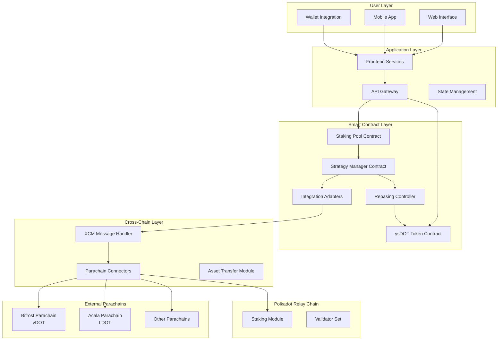

## Core Protocol Flow

### Staking Flow

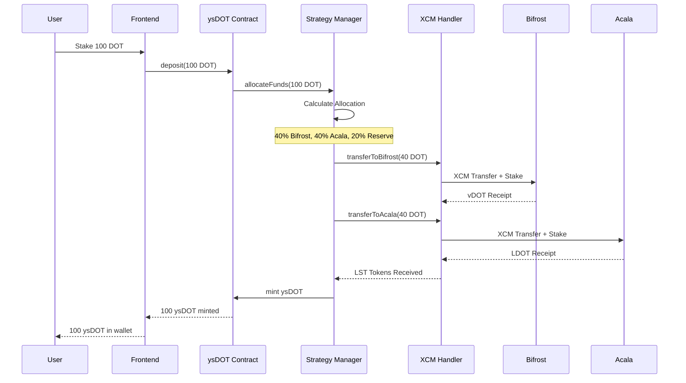

### Rebasing Flow

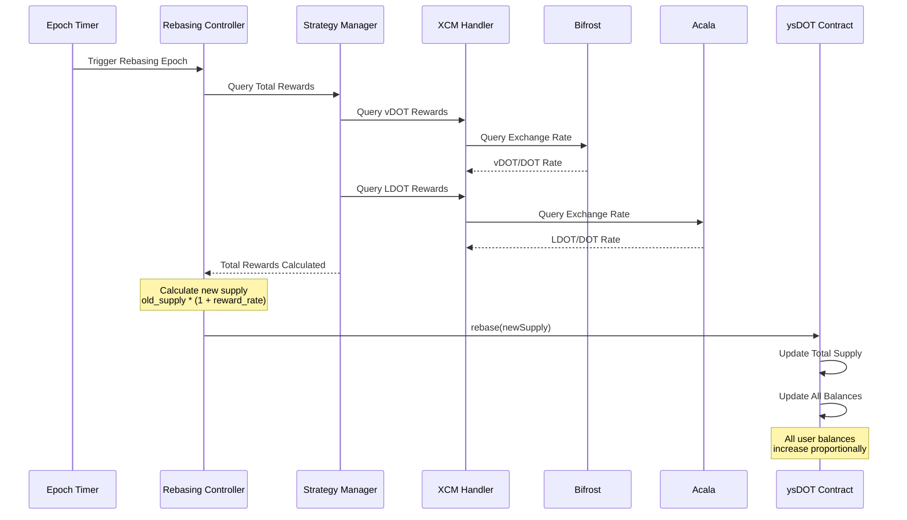

### Unstaking/Redemption Flow

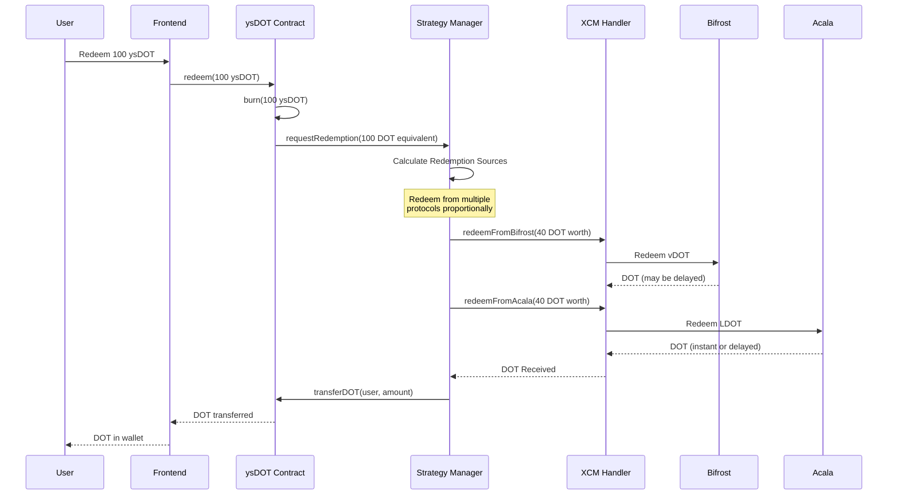

## Component Architecture

### 1. ysDOT Token Contract

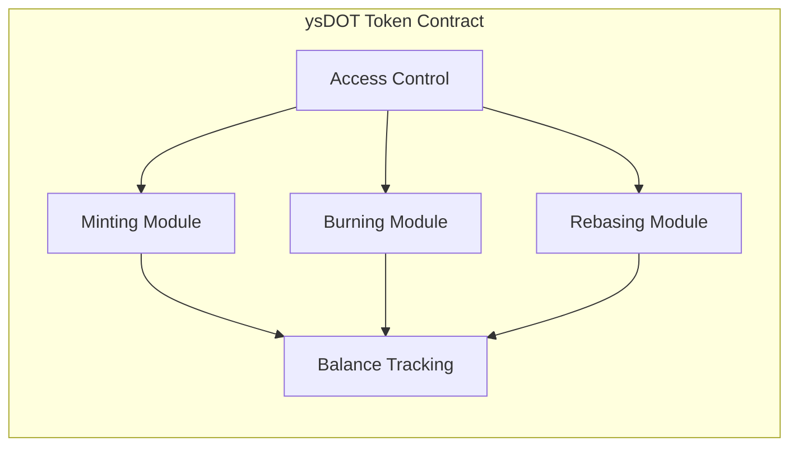

**Responsibilities:**
- Token minting and burning
- Balance management with rebasing
- Access control for authorized contracts
- Event emission for off-chain tracking

**Key Functions:**
- `mint(address, amount)`: Mint ysDOT tokens
- `burn(address, amount)`: Burn ysDOT tokens
- `rebase(uint256 newSupply)`: Adjust total supply
- `balanceOf(address)`: Get rebased balance
- `totalSupply()`: Get current total supply

### 2. Strategy Manager Contract

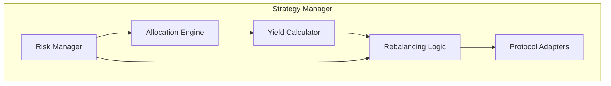

**Responsibilities:**
- Calculate optimal allocation across protocols
- Monitor yield rates
- Execute rebalancing when needed
- Manage protocol integrations
- Assess and manage risks

**Key Functions:**
- `allocateFunds(uint256 amount)`: Distribute funds
- `calculateAllocation()`: Determine optimal split
- `rebalance()`: Adjust allocations
- `getYieldRates()`: Query current yields
- `updateStrategy()`: Modify strategy parameters

### 3. Integration Adapters

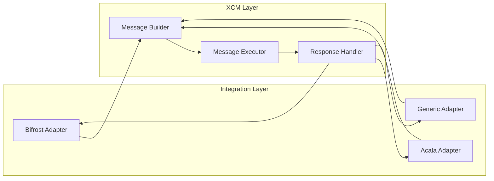

**Responsibilities:**
- Protocol-specific integration logic
- XCM message construction
- Response parsing
- Error handling and retries

**Adapter Interface:**
- `stake(uint256 amount)`: Stake assets
- `unstake(uint256 amount)`: Unstake assets
- `getBalance()`: Query staked balance
- `getExchangeRate()`: Get current rate
- `getYieldRate()`: Calculate APY

### 4. Rebasing Controller

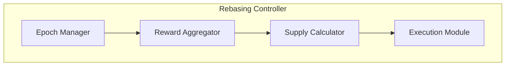

**Responsibilities:**
- Trigger rebasing at appropriate intervals
- Aggregate rewards from all strategies
- Calculate new supply
- Execute rebasing on token contract

**Key Functions:**
- `triggerRebase()`: Initiate rebasing process
- `calculateRewards()`: Sum rewards from all sources
- `calculateNewSupply()`: Determine new total supply
- `executeRebase()`: Update token supply

## Data Flow Architecture

### State Management

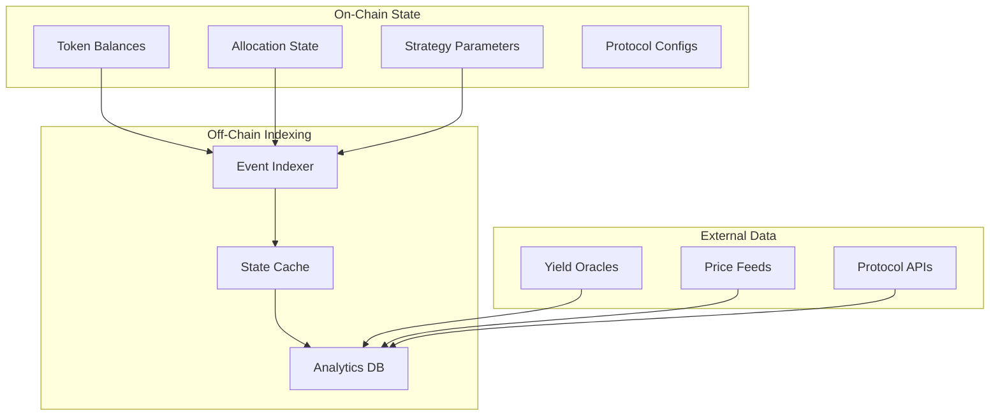

## Security Architecture

### Multi-Layer Security

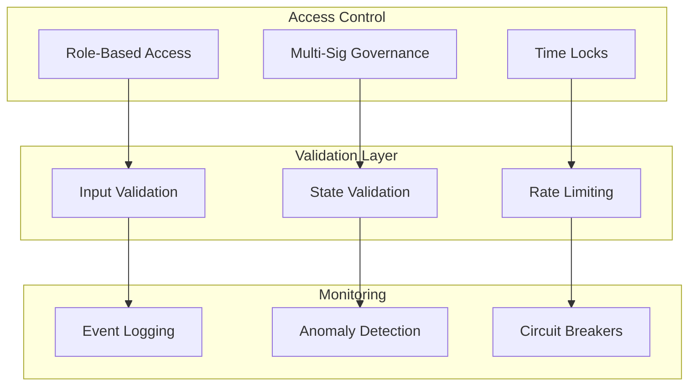

## Cross-Chain Communication Architecture

### XCM Message Flow

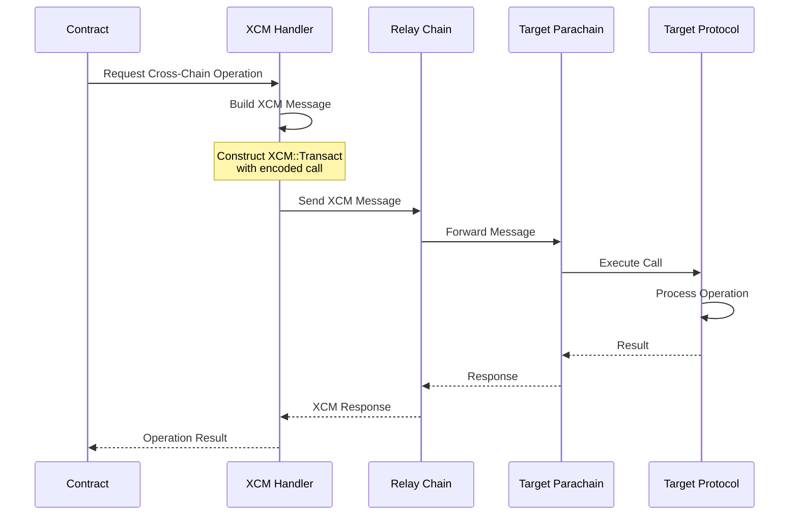

## Scalability Considerations

### Horizontal Scaling

- **Stateless Services**: Frontend and API services can scale horizontally
- **Database Sharding**: Partition data by user or time
- **Caching Layer**: Redis for frequently accessed data
- **Load Balancing**: Distribute requests across instances

### Vertical Scaling

- **Batch Operations**: Group multiple operations
- **Gas Optimization**: Efficient contract design
- **State Compression**: Minimize on-chain storage
- **Lazy Evaluation**: Compute only when needed

## Monitoring & Observability

### Key Metrics

1. **Protocol Metrics**
   - TVL (Total Value Locked)
   - Number of stakers
   - Average stake size
   - Protocol APY

2. **Technical Metrics**
   - Transaction success rate
   - XCM message success rate
   - Gas usage
   - Block confirmation times

3. **Financial Metrics**
   - Yield distribution
   - Fee collection
   - Treasury balance
   - Insurance fund status

### Alerting

- Unusual withdrawal patterns
- XCM message failures
- Significant yield drops
- Contract errors
- Unauthorized access attempts

