# Yieldstark Architecture Diagrams: Complete Visual Reference

## System Overview Diagram

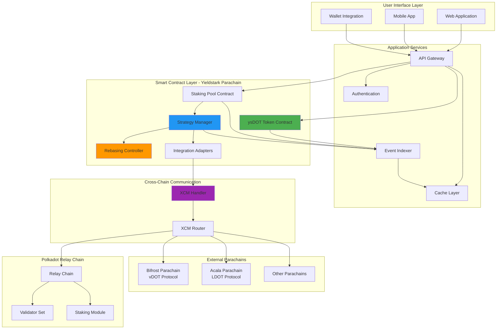

## Complete Staking Flow

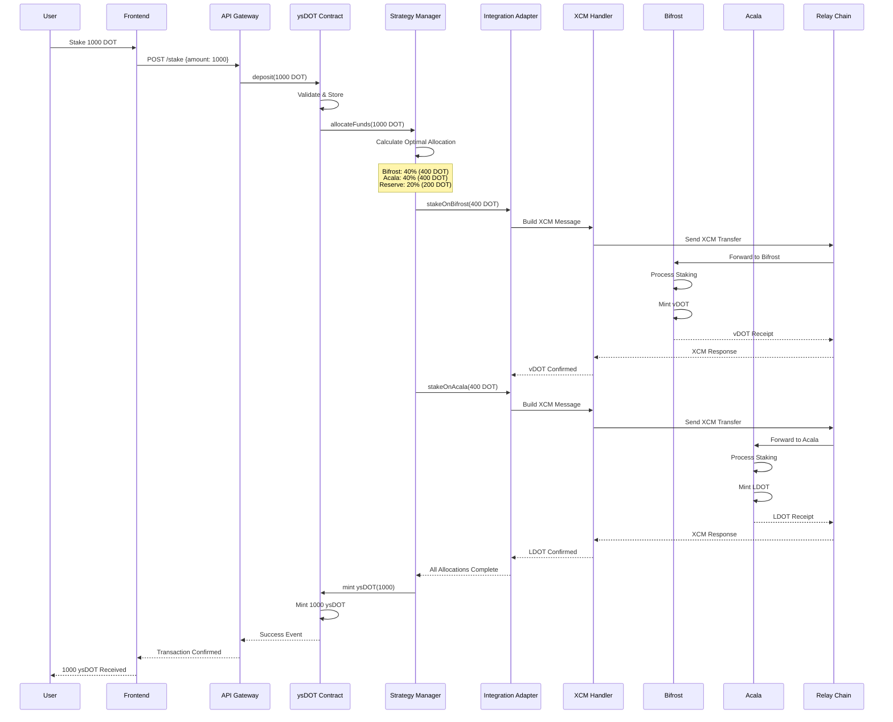

## Rebasing Mechanism Flow

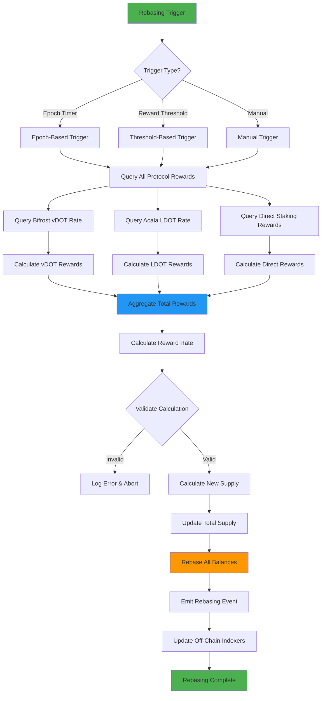

## Multi-Strategy Allocation Logic

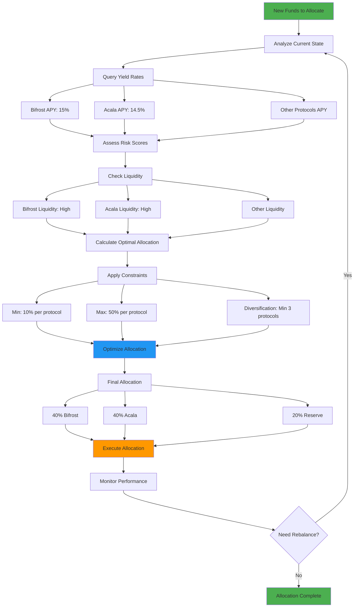

## Unstaking/Redemption Flow

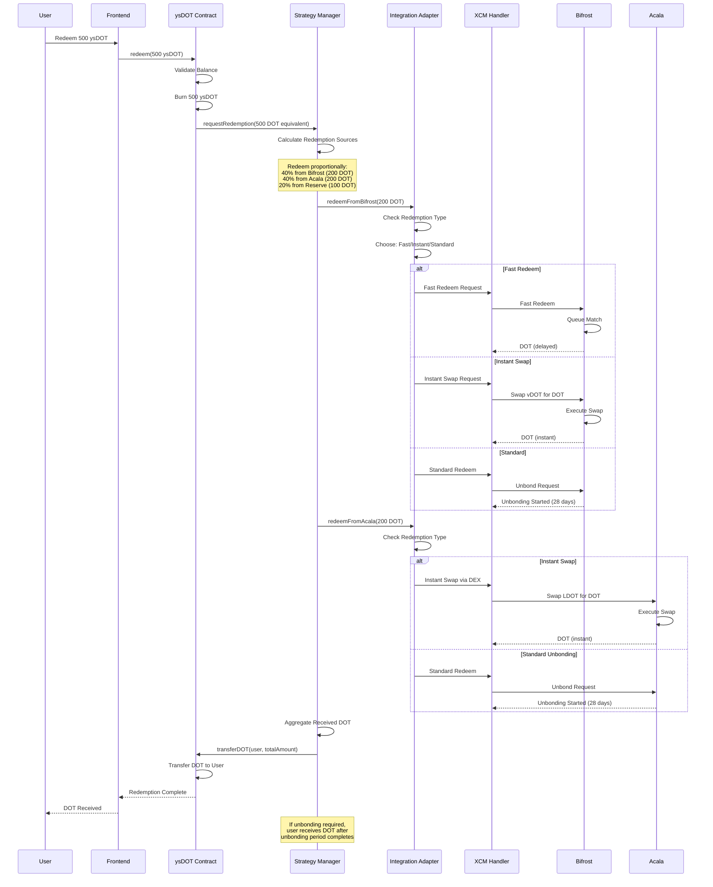

## XCM Message Flow

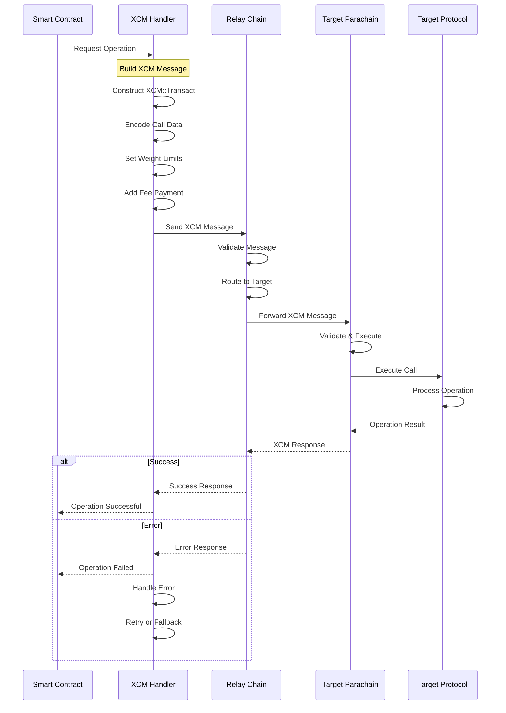

## State Management Architecture

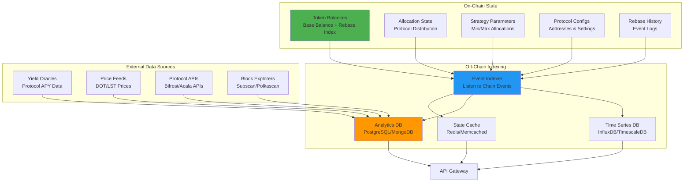

## Security Architecture

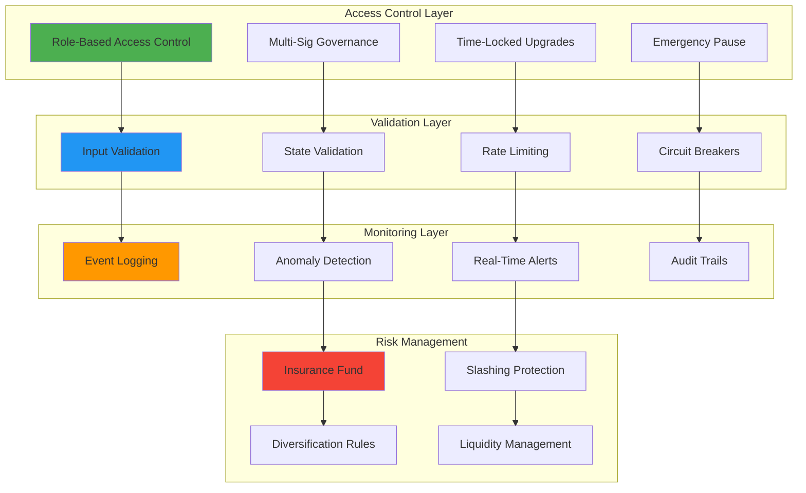

## Integration Adapter Pattern

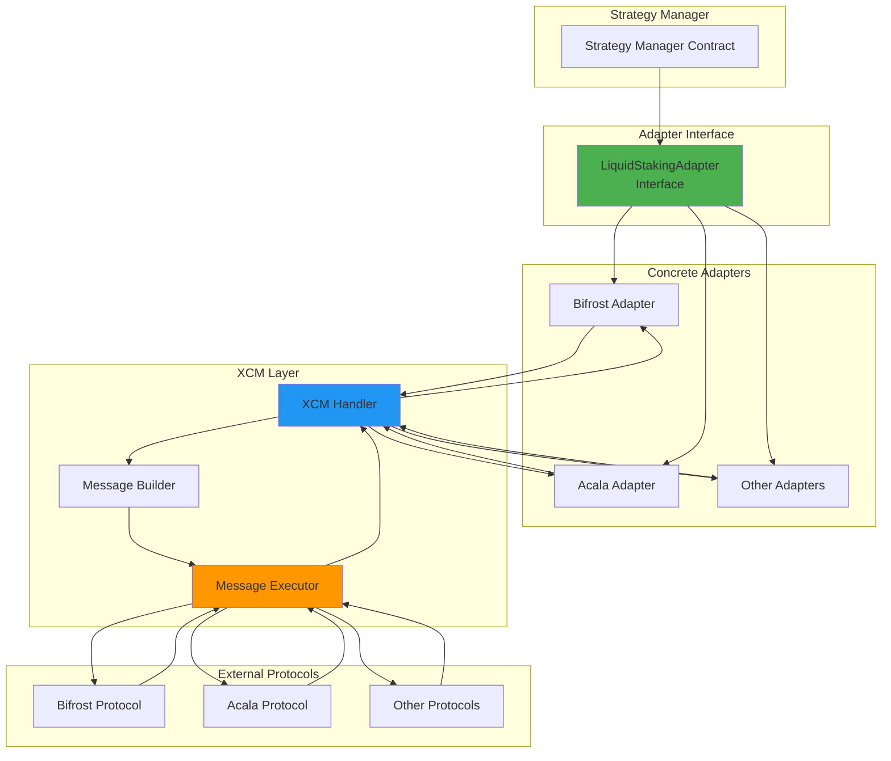

## Governance Flow

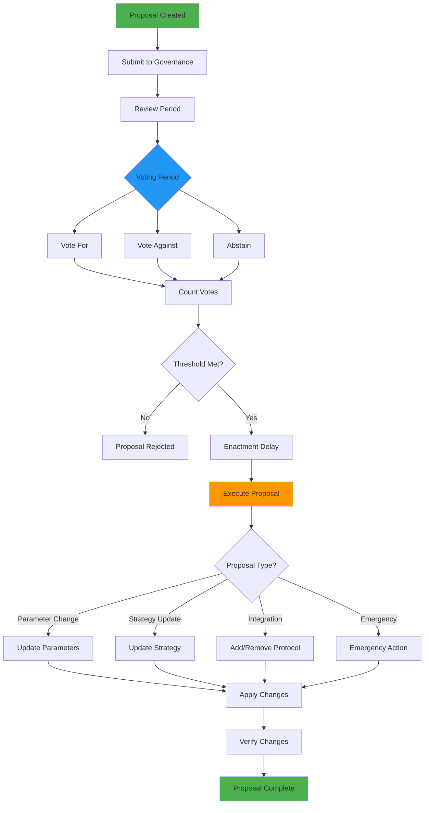

## Data Flow: Reward Aggregation

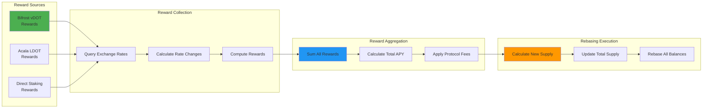

