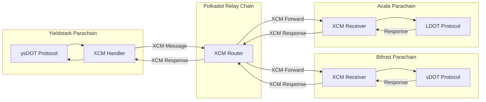

# Parachain Integration Guide: Bifrost, Acala & More

## Overview

This document details the integration requirements, technical specifications, and operational procedures for connecting Yieldstark's ysDOT protocol with various Polkadot parachain liquid staking protocols.

## Integration Architecture

### Cross-Chain Communication via XCM



## Bifrost Integration

### Protocol Overview

**Parachain ID**: 2030  
**Website**: https://bifrost.io  
**Documentation**: https://wiki.bifrost.io

### vDOT Token Mechanics

**Token Type**: vToken (vDOT)  
**Mechanism**: Exchange rate appreciation  
**Redemption Options**:
- **Fast Redeem**: Queue-matched redemption (faster)
- **Instant Swap**: Via stable pools (instant, may have slippage)

### Key Technical Details

#### Staking Process

1. **Transfer DOT to Bifrost**
   - Use XCM to transfer DOT from Yieldstark parachain
   - Destination: Bifrost parachain account

2. **Mint vDOT**
   - Call Bifrost's liquid staking pallet
   - Receive vDOT tokens based on current exchange rate

3. **Track Exchange Rate**
   - Monitor vDOT/DOT exchange rate
   - Calculate rewards from rate appreciation

#### Exchange Rate Calculation

```
vDOT Exchange Rate = Total Staked DOT / Total vDOT Supply
Rewards = (New Rate - Old Rate) × vDOT Balance
```

#### XCM Integration Points

**Pallet**: `bifrost-liquid-staking`  
**Key Functions**:
- `mint_vtoken(amount)`: Stake DOT and mint vDOT
- `redeem_vtoken(amount)`: Redeem vDOT for DOT
- `fast_redeem(amount)`: Fast redemption via queue
- `query_exchange_rate()`: Get current vDOT/DOT rate

#### XCM Message Structure

```rust
// Staking DOT on Bifrost
XCM::Transact {
    origin_kind: SovereignAccount,
    require_weight_at_most: 1_000_000_000,
    call: {
        pallet: bifrost_liquid_staking,
        function: mint_vtoken,
        args: [amount, currency_id]
    }
}
```

### Integration Contract Addresses

**Note**: These are example addresses. Actual addresses depend on deployment.

- **Bifrost Parachain**: `2030` (Parachain ID)
- **Liquid Staking Pallet**: `bifrost-liquid-staking` (pallet index)
- **vDOT Asset ID**: `VDOT` (asset identifier)

### API Endpoints

- **Mainnet RPC**: `wss://bifrost-rpc.liebi.com`
- **Testnet RPC**: `wss://bifrost-testnet.liebi.com`
- **Explorer**: https://bifrost.subscan.io

### Reward Calculation

**Method**: Exchange rate tracking  
**Frequency**: Continuous (rate updates with each block)  
**APY Range**: Typically 12-18% (varies with network conditions)

### Redemption Process

1. **Standard Redemption**
   - Submit redemption request
   - Wait for unbonding period (28 days on Polkadot)
   - Receive DOT after unbonding

2. **Fast Redemption**
   - Queue-matched redemption
   - Faster than standard (depends on queue)
   - May have fees

3. **Instant Swap**
   - Via Bifrost stable pools
   - Instant but may have slippage
   - Requires liquidity in pools

### Risk Considerations

- **Unbonding Period**: 28 days for standard redemption
- **Exchange Rate Risk**: Rate can fluctuate
- **Liquidity Risk**: Instant swaps depend on pool liquidity
- **Validator Risk**: Underlying validator slashing

## Acala Integration

### Protocol Overview

**Parachain ID**: 2000  
**Website**: https://acala.network  
**Documentation**: https://wiki.acala.network

### LDOT Token Mechanics

**Token Type**: LDOT (Liquid DOT)  
**Mechanism**: Exchange rate appreciation via Homa protocol  
**Redemption Options**:
- **Instant Swap**: Via Acala DEX (instant)
- **Delayed Unbonding**: Standard unbonding (28 days)

### Key Technical Details

#### Staking Process

1. **Transfer DOT to Acala**
   - XCM transfer from Yieldstark parachain
   - Destination: Acala parachain account

2. **Mint LDOT via Homa**
   - Call Acala's Homa liquid staking pallet
   - Receive LDOT based on current exchange rate

3. **Track Exchange Rate**
   - Monitor LDOT/DOT exchange rate
   - Calculate rewards from rate changes

#### Exchange Rate Calculation

```
LDOT Exchange Rate = Total Staked DOT / Total LDOT Supply
Rewards = (New Rate - Old Rate) × LDOT Balance
```

#### XCM Integration Points

**Pallet**: `homa` (Acala's liquid staking pallet)  
**Key Functions**:
- `mint(amount)`: Stake DOT and mint LDOT
- `request_redeem(amount)`: Request LDOT redemption
- `get_exchange_rate()`: Query current LDOT/DOT rate
- `get_total_staking_currency()`: Get total staked amount

#### XCM Message Structure

```rust
// Staking DOT on Acala
XCM::Transact {
    origin_kind: SovereignAccount,
    require_weight_at_most: 1_000_000_000,
    call: {
        pallet: homa,
        function: mint,
        args: [amount]
    }
}
```

### Integration Contract Addresses

- **Acala Parachain**: `2000` (Parachain ID)
- **Homa Pallet**: `homa` (pallet index)
- **LDOT Asset ID**: `LDOT` (asset identifier)

### API Endpoints

- **Mainnet RPC**: `wss://acala-rpc-0.aca-api.network`
- **Testnet RPC**: `wss://acala-rpc-node-0.aca-testnet.aca-dev.network`
- **Explorer**: https://acala.subscan.io

### Reward Calculation

**Method**: Exchange rate tracking  
**Frequency**: Continuous  
**APY Range**: Typically 12-17% (varies with network conditions)

### Redemption Process

1. **Instant Swap**
   - Via Acala DEX
   - Swap LDOT for DOT instantly
   - May have slippage and fees

2. **Delayed Unbonding**
   - Standard redemption process
   - 28-day unbonding period
   - Receive DOT after unbonding completes

### Risk Considerations

- **Unbonding Period**: 28 days for standard redemption
- **DEX Liquidity**: Instant swaps require DEX liquidity
- **Exchange Rate Risk**: Rate fluctuations
- **Protocol Risk**: Acala protocol-specific risks

## Other Potential Integrations

### Lido on Moonbeam

**Parachain**: Moonbeam (Parachain ID: 2004)  
**Token**: stDOT  
**Mechanism**: Exchange rate appreciation  
**Integration**: Similar to Bifrost/Acala

### Parallel Finance

**Parachain**: Parallel (Parachain ID: 2012)  
**Token**: sDOT  
**Mechanism**: Liquid staking derivative  
**Integration**: XCM-based integration

## XCM Implementation Details

### Message Types

#### 1. Asset Transfer

```rust
XCM::ReserveAssetDeposited {
    assets: vec![
        (Here, amount).into()
    ],
    effects: vec![
        DepositAsset {
            assets: vec![(Here, amount).into()],
            beneficiary: target_account
        }
    ]
}
```

#### 2. Remote Call

```rust
XCM::Transact {
    origin_kind: SovereignAccount,
    require_weight_at_most: weight_limit,
    call: encoded_call.into()
}
```

#### 3. Query Response

```rust
XCM::QueryResponse {
    query_id: query_id,
    response: Response::Assets(assets),
    max_weight: weight_limit,
    querier: Some(origin)
}
```

### Weight Calculation

**Staking Operation Weight**:
- Base weight: ~100,000,000
- Storage operations: ~50,000,000
- Total: ~150,000,000 weight units

**Redemption Operation Weight**:
- Base weight: ~80,000,000
- Storage operations: ~40,000,000
- Total: ~120,000,000 weight units

### Error Handling

**Common XCM Errors**:
- `Barrier`: Message filtered
- `WeightLimitReached`: Operation too heavy
- `NotHolding`: Insufficient assets
- `Trap`: Execution failure

**Retry Strategy**:
- Exponential backoff
- Maximum retry attempts
- Fallback to alternative protocols

## Integration Adapter Pattern

### Adapter Interface

```rust
trait LiquidStakingAdapter {
    // Stake assets and receive LST
    fn stake(amount: Balance) -> Result<LSTReceipt, Error>;
    
    // Redeem LST for underlying asset
    fn redeem(amount: Balance, instant: bool) -> Result<RedemptionReceipt, Error>;
    
    // Query current exchange rate
    fn get_exchange_rate() -> Result<ExchangeRate, Error>;
    
    // Query current balance
    fn get_balance() -> Result<Balance, Error>;
    
    // Query yield rate (APY)
    fn get_yield_rate() -> Result<APY, Error>;
}
```

### Bifrost Adapter Implementation

```rust
struct BifrostAdapter {
    parachain_id: ParaId,
    pallet_index: u8,
    asset_id: AssetId,
}

impl LiquidStakingAdapter for BifrostAdapter {
    fn stake(&self, amount: Balance) -> Result<LSTReceipt> {
        // 1. Transfer DOT via XCM
        // 2. Call mint_vtoken via XCM Transact
        // 3. Receive vDOT receipt
        // 4. Return receipt
    }
    
    fn get_exchange_rate(&self) -> Result<ExchangeRate> {
        // Query vDOT/DOT rate via XCM query
    }
}
```

### Acala Adapter Implementation

```rust
struct AcalaAdapter {
    parachain_id: ParaId,
    pallet_index: u8,
    asset_id: AssetId,
}

impl LiquidStakingAdapter for AcalaAdapter {
    fn stake(&self, amount: Balance) -> Result<LSTReceipt> {
        // 1. Transfer DOT via XCM
        // 2. Call homa.mint via XCM Transact
        // 3. Receive LDOT receipt
        // 4. Return receipt
    }
    
    fn get_exchange_rate(&self) -> Result<ExchangeRate> {
        // Query LDOT/DOT rate via XCM query
    }
}
```

## Monitoring & Maintenance

### Key Metrics to Monitor

1. **Exchange Rates**
   - vDOT/DOT rate
   - LDOT/DOT rate
   - Rate change velocity

2. **Protocol Health**
   - Total value locked
   - Redemption queue length
   - Liquidity pool depth

3. **XCM Performance**
   - Message success rate
   - Average execution time
   - Error frequency

4. **Yield Rates**
   - Current APY per protocol
   - Historical APY trends
   - Yield comparison

### Alerting

- Exchange rate anomalies
- XCM message failures
- Low liquidity warnings
- High redemption queue
- Protocol downtime

## Security Considerations

### Risk Mitigation

1. **Multi-Sig Operations**: Critical operations require multi-sig
2. **Rate Limits**: Prevent rapid large withdrawals
3. **Circuit Breakers**: Pause operations during anomalies
4. **Audit Requirements**: Regular security audits
5. **Insurance Fund**: Cover potential losses

### Access Control

- **Admin Functions**: Restricted to governance
- **Integration Updates**: Time-locked changes
- **Emergency Pause**: Quick response capability

## Testing Strategy

### Test Environments

1. **Local Testnet**: Substrate node with mock parachains
2. **Rococo Testnet**: Real parachain testnet
3. **Kusama**: Canary network testing
4. **Mainnet**: Gradual rollout with limits

### Test Scenarios

- Successful staking operations
- Redemption flows (standard and instant)
- Exchange rate queries
- XCM error handling
- Multi-protocol rebalancing
- Edge cases and failure modes

## Documentation References

### Bifrost
- **Wiki**: https://wiki.bifrost.io
- **GitHub**: https://github.com/bifrost-finance
- **API Docs**: https://docs.bifrost.io

### Acala
- **Wiki**: https://wiki.acala.network
- **GitHub**: https://github.com/AcalaNetwork
- **API Docs**: https://docs.acala.network

### XCM
- **Polkadot Wiki**: https://wiki.polkadot.network/docs/learn-crosschain
- **XCM Format**: https://github.com/paritytech/xcm-format
- **XCM SDK**: https://github.com/paritytech/xcm-sdk

