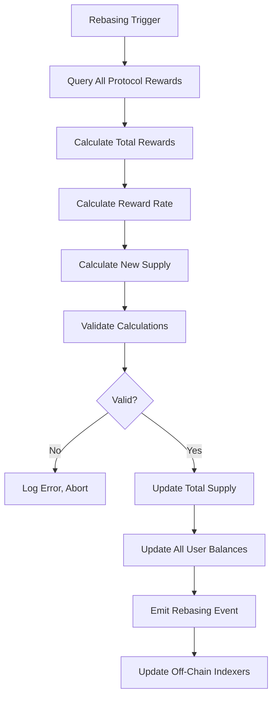

# ysDOT Token Mechanics: Rebasing Derivative Design

## Overview

ysDOT is designed as a **Rebasing Derivative Token** that automatically accrues staking rewards through supply adjustments rather than exchange rate appreciation. This document details the mechanics, formulas, and implementation considerations.

## Rebasing Token Model

### Core Concept

A rebasing token maintains a stable exchange rate (1 ysDOT = 1 DOT) while the total supply increases to reflect accrued rewards. User balances grow proportionally with the total supply.

### Mathematical Model

#### Basic Rebasing Formula

```
New Supply = Old Supply × (1 + Reward Rate)
New Balance = Old Balance × (1 + Reward Rate)
Exchange Rate = 1.0 (constant)
```

#### Detailed Calculation

**Step 1: Calculate Total Rewards**
```
Total Rewards = Σ(Protocol_i_Balance × Protocol_i_Yield_Rate × Time_Period)
```

**Step 2: Calculate Reward Rate**
```
Reward Rate = Total Rewards / Total Staked DOT
```

**Step 3: Calculate New Supply**
```
New Supply = Current Supply × (1 + Reward Rate)
```

**Step 4: Update All Balances**
```
New Balance[user] = Current Balance[user] × (1 + Reward Rate)
```

### Example Calculation

**Initial State:**
- Total Supply: 1,000,000 ysDOT
- User A Balance: 10,000 ysDOT
- User B Balance: 50,000 ysDOT
- Total Staked DOT: 1,000,000 DOT

**After Epoch (Rewards Accrued):**
- Total Rewards: 5,000 DOT (0.5% APY for epoch)
- Reward Rate: 5,000 / 1,000,000 = 0.005 (0.5%)

**New State:**
- New Supply: 1,000,000 × 1.005 = 1,005,000 ysDOT
- User A New Balance: 10,000 × 1.005 = 10,050 ysDOT
- User B New Balance: 50,000 × 1.005 = 50,250 ysDOT
- Exchange Rate: Still 1.0 (1 ysDOT = 1 DOT)

## Reward Aggregation

### Multi-Strategy Reward Calculation

Since ysDOT aggregates rewards from multiple protocols, the total reward rate is a weighted average:

```
Total Reward Rate = Σ(Allocation_i × Protocol_i_Yield_Rate)
```

Where:
- `Allocation_i` = Percentage of total funds in protocol i
- `Protocol_i_Yield_Rate` = Current yield rate of protocol i

### Example Multi-Strategy Calculation

**Allocation:**
- 40% in Bifrost (vDOT) at 15% APY
- 40% in Acala (LDOT) at 14.5% APY
- 20% in Reserve at 0% APY

**Weighted Average:**
```
Total APY = (0.40 × 15%) + (0.40 × 14.5%) + (0.20 × 0%)
          = 6% + 5.8% + 0%
          = 11.8% APY
```

**Per Epoch (assuming 6-hour epochs, 365 days):**
```
Epochs per Year = (365 × 24) / 6 = 1,460 epochs
Epoch Reward Rate = 11.8% / 1,460 = 0.00808% per epoch
```

## Rebasing Implementation

### Rebasing Triggers

#### 1. Time-Based Rebasing
- **Epoch-Based**: Trigger at end of each Polkadot era/epoch
- **Fixed Interval**: Every N blocks (e.g., every 1,000 blocks)
- **Daily**: Once per 24-hour period

#### 2. Threshold-Based Rebasing
- **Reward Threshold**: When accrued rewards exceed X DOT
- **Percentage Threshold**: When reward rate exceeds Y%
- **Combined**: Time + threshold (whichever comes first)

#### 3. Event-Based Rebasing
- **Protocol Reward Distribution**: When integrated protocols distribute rewards
- **Manual Trigger**: Governance-initiated rebasing
- **Emergency**: Manual override for corrections

### Rebasing Process Flow



### Gas Optimization for Rebasing

Rebasing requires updating all user balances, which can be gas-intensive. Strategies:

1. **Lazy Balance Calculation**
   - Store base balance and rebase index
   - Calculate actual balance on-demand
   - Formula: `balance = base_balance × rebase_index`

2. **Rebase Index Approach**
   ```
   Rebase Index = Total Supply / Initial Supply
   Actual Balance = Base Balance × Rebase Index
   ```

3. **Snapshot Mechanism**
   - Take snapshots at rebase events
   - Users query latest snapshot
   - Off-chain indexing for historical data

## Balance Tracking

### Base Balance + Rebase Index Model

**Storage Structure:**
```solidity
struct UserBalance {
    uint256 baseBalance;      // Original balance
    uint256 lastRebaseIndex;   // Rebase index at last update
}

uint256 public rebaseIndex;    // Current rebase index (scaled by 1e18)
```

**Balance Calculation:**
```solidity
function balanceOf(address user) public view returns (uint256) {
    UserBalance storage userBal = balances[user];
    return (userBal.baseBalance * rebaseIndex) / 1e18;
}
```

**Rebasing Update:**
```solidity
function rebase(uint256 newSupply) internal {
    uint256 oldSupply = totalSupply();
    rebaseIndex = (rebaseIndex * newSupply) / oldSupply;
    totalSupply = newSupply;
    emit Rebase(oldSupply, newSupply, rebaseIndex);
}
```

## Reward Sources

### 1. Bifrost vDOT Rewards

**Mechanism:**
- vDOT uses exchange rate appreciation
- Exchange rate increases with staking rewards
- Need to track rate changes to calculate rewards

**Reward Calculation:**
```
vDOT Balance = DOT Amount / vDOT Exchange Rate
Rewards = (Current Rate - Previous Rate) × vDOT Balance
```

### 2. Acala LDOT Rewards

**Mechanism:**
- LDOT also uses exchange rate appreciation
- Similar to vDOT but different rate calculation
- May have different unbonding periods

**Reward Calculation:**
```
LDOT Balance = DOT Amount / LDOT Exchange Rate
Rewards = (Current Rate - Previous Rate) × LDOT Balance
```

### 3. Direct Staking Rewards

**Mechanism:**
- If protocol directly stakes on Relay Chain
- Rewards come from validator payouts
- Need to account for slashing risk

**Reward Calculation:**
```
Direct Staked DOT × Validator APY × Time Period
```

## Exchange Rate Stability

### Maintaining 1:1 Peg

The rebasing mechanism ensures:
- **1 ysDOT always ≈ 1 DOT** (plus accrued rewards)
- Exchange rate remains constant at 1.0
- Value appreciation through supply increase

### Redemption Mechanism

When users redeem ysDOT for DOT:

```
DOT Amount = ysDOT Amount × Exchange Rate
```

Since exchange rate = 1.0:
```
DOT Amount = ysDOT Amount
```

However, actual redemption may account for:
- Protocol fees
- Unbonding delays
- Slippage in instant redemptions

## Integration with DeFi

### Stable Exchange Rate Benefits

1. **Lending Protocols**: Easier to use as collateral (stable price)
2. **AMM Pools**: Reduced impermanent loss
3. **Yield Farming**: Predictable token value
4. **Price Oracles**: Simpler oracle feeds (always ≈ 1 DOT)

### Considerations

1. **Balance Changes**: DeFi protocols must handle rebasing
2. **Event Monitoring**: Track rebase events for off-chain systems
3. **Oracle Updates**: Ensure oracles reflect rebased balances
4. **Contract Compatibility**: Some protocols may not support rebasing

## Fee Structure

### Protocol Fees

Fees are deducted from rewards before rebasing:

```
Net Reward Rate = Gross Reward Rate × (1 - Protocol Fee Rate)
```

**Example:**
- Gross Rewards: 5,000 DOT
- Protocol Fee: 10%
- Net Rewards: 4,500 DOT
- Fee to Treasury: 500 DOT

### Fee Distribution

1. **Treasury**: Protocol development and operations
2. **Insurance Fund**: Slashing protection
3. **Stakers**: Remaining rewards via rebasing

## Slashing Handling

### Slashing Impact

If a validator is slashed:
- Underlying LST value decreases
- ysDOT supply must decrease to maintain peg

**Negative Rebasing:**
```
New Supply = Old Supply × (1 - Slashing Rate)
```

### Mitigation Strategies

1. **Insurance Fund**: Cover slashing losses
2. **Diversification**: Spread across many validators
3. **Validator Selection**: Choose reputable validators
4. **Gradual Adjustment**: Smooth slashing impact over time

## Event Emission

### Rebasing Events

```solidity
event Rebase(
    uint256 previousSupply,
    uint256 newSupply,
    uint256 rebaseIndex,
    uint256 rewardRate,
    uint256 timestamp
);
```

### Reward Breakdown Events

```solidity
event RewardBreakdown(
    uint256 bifrostRewards,
    uint256 acalaRewards,
    uint256 directRewards,
    uint256 totalRewards,
    uint256 protocolFees
);
```

## Off-Chain Indexing

### Required Data

1. **Rebase History**: All rebasing events
2. **Balance Snapshots**: User balances at each rebase
3. **Reward Tracking**: Per-protocol reward contributions
4. **APY Calculation**: Historical and current APY

### Indexing Strategy

- Index all rebase events
- Calculate historical balances
- Track APY over time
- Provide API endpoints for frontend

## Testing Considerations

### Test Scenarios

1. **Normal Rebasing**: Standard reward accrual
2. **High Reward Rate**: Extreme reward scenarios
3. **Negative Rebasing**: Slashing events
4. **Multi-Protocol**: Different reward rates from protocols
5. **Gas Optimization**: Verify efficient balance updates
6. **Edge Cases**: Zero balances, maximum supply, etc.

### Test Data

- Various allocation percentages
- Different reward rates
- Multiple rebasing frequencies
- Large and small balances

